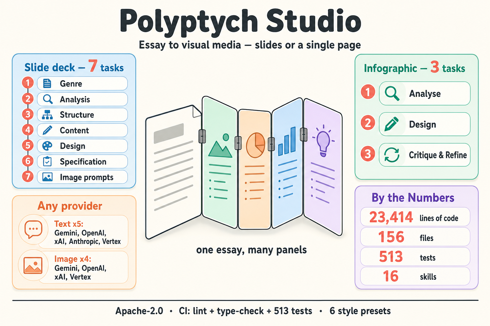
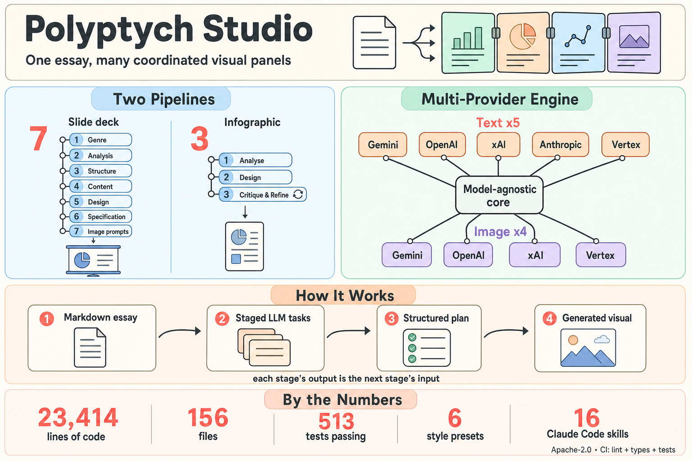

# Polyptych Studio



Turn a source essay (markdown) into visual media. Polyptych Studio ships two
fully independent pipelines — a **slide deck** generator and a **single-page
infographic** generator — built on multi-provider text generation (Gemini,
OpenAI, xAI, Anthropic, Vertex AI) and multi-provider image generation (Gemini,
OpenAI, xAI, Vertex AI via [`pixbridge`](https://pypi.org/project/pixbridge/)).

**[Full documentation](docs/index.md)** — tutorial, how-to guides, reference, and architecture explanation.

## Pipelines

Each pipeline takes a source essay (markdown) and produces a different kind of visual output.

| Pipeline | Command | Output | Use case |
|----------|---------|--------|----------|
| **Slide** | `polyptych deck` | Presentation deck (10–30 slides with images) | Essay-to-slides conversion |
| **Infographic** | `polyptych infographic` | Single-page infographic(s), N variants | Quick visual summary of key data |

Both run unattended end-to-end: the LLM text tasks (slide: `task1`→`task7`;
infographic: `i0`→`i2`) run first, then image generation.



> Both infographics above were generated by Polyptych Studio itself from
> [`examples/about-polyptych-studio.md`](examples/about-polyptych-studio.md)
> using the `infographic` pipeline and the
> [`semi-flat-vector`](prompts/style-transfer/infographic/semi-flat-vector.md) style.

For more examples, see the AI-generated part of my homepage:
[jdinkla.github.io/ai-generated](https://jdinkla.github.io/ai-generated/index.html#experiments).

## Installation

Install the published package (the distribution and import name is `polyptych`;
this repository is `polyptych-studio`):

```bash
pip install polyptych        # or: uv add polyptych
```

Or work from a clone of this repo:

```bash
uv sync
```

Optional external tool: **ImageMagick** (`brew install imagemagick`) for
collecting a slide deck into a PDF via `just create-pdf`.

### Environment variables

Set a key for each provider you intend to use (copy `.envrc.example` to `.envrc`,
or export them however you manage secrets):

| Provider | Environment variable |
|----------|---------------------|
| Gemini (text + image) | `GOOGLE_API_KEY` |
| OpenAI (text + gpt-image-2) | `OPENAI_API_KEY` |
| xAI / Grok | `XAI_API_KEY` |
| Anthropic Claude | `ANTHROPIC_API_KEY` |
| Vertex AI | Application Default Credentials (`gcloud auth application-default login`) |

## Quick start

An example source (`examples/scene.md`, a short noir scene) ships with the repo.

```bash
# Infographic (3 text tasks + images)
uv run polyptych infographic examples/scene.md -o generated/my-infographic

# Slide deck
uv run polyptych deck examples/scene.md -o generated/my-slides
```

### With style presets

A few example visual-style presets ship under `prompts/style-transfer/`
(`anime/`, `editorial/`, `infographic/`, `noir/`, `period-art/`). Point `--style`
at any preset markdown file, or author your own (see
[Write Style Prompts](docs/how-to/write-style-prompts.md)):

```bash
uv run polyptych deck examples/scene.md --style prompts/style-transfer/noir/cinematic-illustrative-noir.md
uv run polyptych infographic examples/scene.md --style prompts/style-transfer/infographic/semi-flat-vector.md
```

### Presets, resume, and selective regeneration

```bash
# Reusable provider/size/quality bundles from image-presets.yaml
uv run polyptych deck examples/scene.md --image-preset openai-high

# Resume from image generation (text tasks already done)
uv run polyptych deck examples/scene.md -o generated/my-slides --from images

# Regenerate specific slides only
uv run polyptych deck examples/scene.md -o generated/my-slides --from images --slides 3,7,12
```

See the [Resume Pipeline](docs/how-to/resume-pipeline.md) guide for details.
Use `just --list` for all workflow shortcuts and the
[CLI Reference](docs/reference/cli-reference.md) for the full flag set.

## Operating modes

The system can be driven two ways:

- **Python CLI** — run `polyptych` directly (or via `just` targets). Best for
  scripts, CI, batch runs, and reproducible pipelines.
- **Claude Code skills** — inside a Claude Code session, type slash commands
  like `/run-pipeline`, `/run-local-pipeline`, `/infographic`, `/review-regen`,
  `/edit-output`. Best for exploration, guided iteration, and running text tasks
  with Claude as the LLM (zero API cost for text). The skill list is in
  [CLAUDE.md](CLAUDE.md).

Both surfaces share the same task templates, schemas, and output layout. See
[Operating Modes](docs/explanation/operating-modes.md) for the comparison.

## Project structure

```
src/
  common/                    # Shared utilities (usage logging)
  polyptych/                 # Pipelines, CLI, models, tasks
    pipeline.py              # Pipeline orchestration (slide + infographic mixins)
    cli.py                   # polyptych CLI
    models/                  # Pydantic schemas (slide.py, infographic.py)
    tasks/                   # Task implementations (task_01..task_07, task_i0..task_i2)
prompts/
  tasks/                     # Task prompt templates
  style-transfer/            # Example visual style presets
  providers/                 # Provider-specific best practices
docs/                        # Documentation (tutorial, how-to, reference, explanation)
model_config.yaml            # Per-task LLM model tier configuration
image_model_config.yaml      # Per-provider image generation model configuration
image-presets.yaml           # Reusable image-generation presets
pipeline-presets.yaml        # Pipeline-specific behavior presets
justfile                     # Common workflow shortcuts
```

Image generation is provided by the [`pixbridge`](https://pypi.org/project/pixbridge/)
PyPI package (`pixbridge` CLI), which supports Gemini, OpenAI, xAI, and Vertex.

## Using Vertex AI

```bash
gcloud auth login
gcloud auth application-default login
```

Vertex AI uses Application Default Credentials. The `vertex` text and image
providers use the same Gemini models but route through Google Cloud.

## Continuous integration

`.github/workflows/ci.yml` runs on every pull request and on pushes to `main`,
gating three checks (a failure in any fails the build):

| Check      | Command                            |
|------------|------------------------------------|
| Lint       | `uv run ruff check src/`           |
| Type check | `uv run pyright src/`              |
| Unit tests | `uv run pytest -m "not integration" tests/` |

Run the same locally with `just lint`, `just typecheck`, `just test`.
Integration tests (`@pytest.mark.integration`) are excluded — they call real,
paid LLM / image APIs. All dependencies (including `pixbridge`) resolve from
PyPI, so CI needs no special access.

## License

[Apache-2.0](LICENSE).
